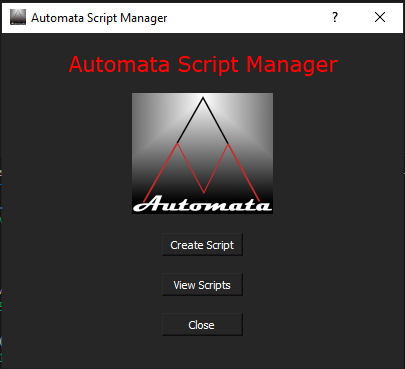
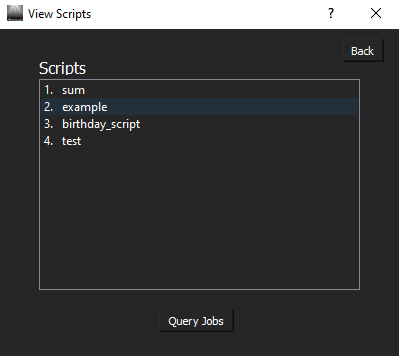
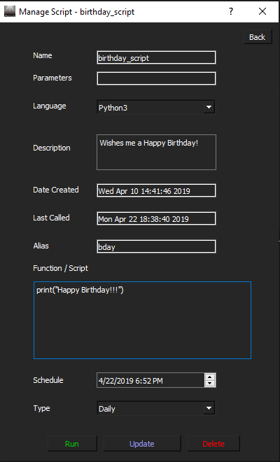

# Automata Script Manager

Automata Script Manager is a tool for managing and running scripts with a user-friendly interface.

## Table of Contents
- [Overview](#overview)
- [Features](#features)
- [Installation](#installation)
- [Usage](#usage)
  - [Creating a New Script](#creating-a-new-script)
  - [Viewing Scripts](#viewing-scripts)
  - [Updating a Script](#updating-a-script)
  - [Running a Script](#running-a-script)
- [Contributing](#contributing)

## Overview
The Automata Project is a Python-based application designed to manage and execute scripts. It provides a graphical user interface (GUI) for creating, updating, viewing, and running scripts. The project leverages PyQt for the GUI components and uses a SQLite database to store script information.

## Features
- Create New Scripts: Users can create new scripts with specified parameters, descriptions, and functions.
- Update Existing Scripts: Users can update the details and functions of existing scripts.
- View Scripts: Users can view a list of all scripts and select individual scripts to view or update.
- Run Scripts: Users can execute scripts directly from the application.
- Delete Scripts: Users can delete scripts from the database.

## Installation

1. Clone the repository:
    ```bash
    git clone https://github.com/yourusername/automata-script-manager.git
    ```
2. Navigate to the project directory:
    ```bash
    cd automata-script-manager
    ```
3. Install the required dependencies:
    ```bash
    pip install -r requirements.txt
    ```

## Usage

1. Run the main application:
    ```bash
    python automata.py
    ```
2. Use the GUI to create, view, update, and run scripts.
3. Should open to this:



### Creating a New Script

- Click on the "Create" button to open the input form.
- Fill in the details and click "Create" to save the script.

### Viewing Scripts

- Click on the "View" button to see the list of scripts.
- Click on a script to manage it.



### Updating a Script

- In the view menu, click on a script to open the update form.
- Modify the details and click "Update" to save changes.



### Running a Script

- In the update form, click "Run" to execute the script.

## Contributing

Contributions are welcome! Please follow these steps:

1. Fork the repository.
2. Create a new branch:
    ```bash
    git checkout -b feature-branch
    ```
3. Make your changes and commit them:
    ```bash
    git commit -m "Add new feature"
    ```
4. Push to the branch:
    ```bash
    git push origin feature-branch
    ```
5. Open a pull request.